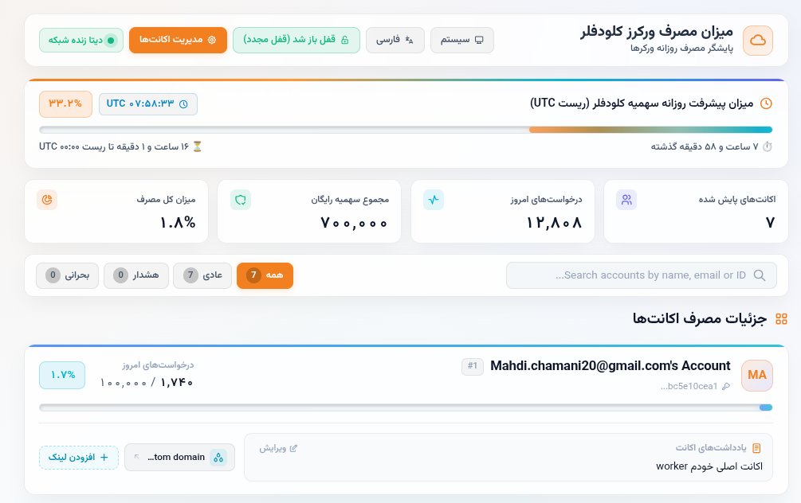
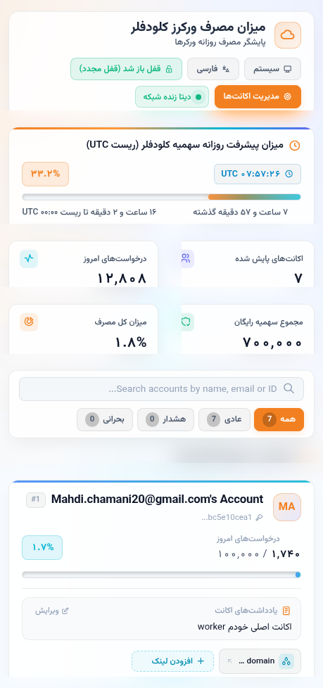

🌐 **Languages:** **English** | [فارسی](README.fa.md)

# Cloudflare Workers Usage Dashboard

A clean, modern, and light/dark theme switchable dashboard to monitor daily Cloudflare Workers usage across multiple accounts. Built entirely as a Cloudflare Worker using Cloudflare KV.

  
  

---

## 📚 Documentation & Quick Links

- 📋 [TODO & Roadmap](docs/TODO.md) - View task list, completed features, and future plans.
- 🚀 [Deployment Guide](docs/DEPLOYMENT.md) - Step-by-step instructions for local development and Cloudflare Workers deployment.
- 🔑 [API Token Permissions Guide](docs/guide.md) - One-click pre-configured token creation link & required permissions guide.

---

## ⚡ Censorship Bypass & Panel Monitoring

You can use this dashboard with custom links to monitor and manage your panels. To bypass internet censorship and track active panels/configurations, check out these community projects:
- **Bia Pain Bache:** [https://github.com/bia-pain-bache](https://github.com/bia-pain-bache)
- **Nahan:** [https://github.com/itsyebekhe/nahan](https://github.com/itsyebekhe/nahan)
- **Nova Proxy:** [https://github.com/IRNova/Nova-Proxy](https://github.com/IRNova/Nova-Proxy)

These repositories provide up-to-date tools, configurations, and panels to facilitate free internet access.
